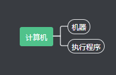
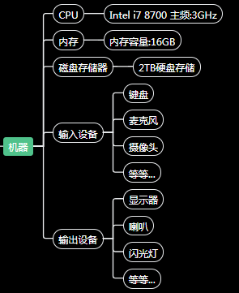
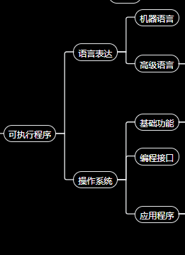
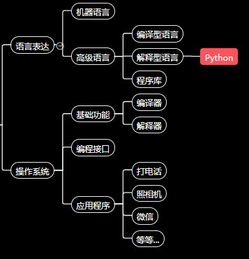
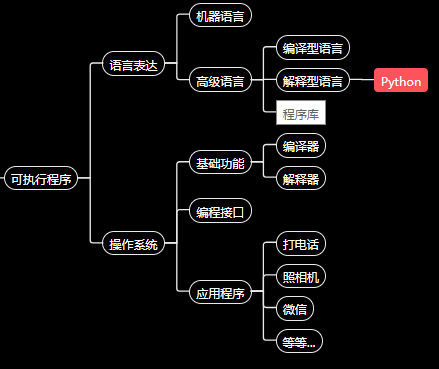
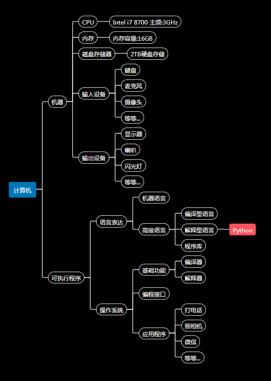

# 理解计算机编程原理

## 概念科普

### 计算机是什么

我们认为`计算机`就是能`执行程序`的机器 。

从咱教程的角度简单的讲，你可以认为`计算机`就是`电脑`/`手机`。

好了, 机器的概念我们应该可以不解释，那么多出了一个新概念`执行程序`是什么意思 ?

> 想象下, 你很幸运, 天命之选 ，上帝之子/女, 有一天你睡着了, 梦中上帝赐给你一个守卫(我们给您的守卫起个名字把，就叫他CE)，他有很强的生理结构，像美国队长那样是个英俊大肌霸选手，但是真的很遗憾，它没有灵魂，没有感情，不过小学数学计算能力特别强, 上帝告诉他，他只能听命于你 。 

那么这时候你可以认为那个CE就是电脑，因为他符合`能执行程序`的机器的概念 , `程序`就是你给他下达的一系列`指令`或者叫`命令`或者给他编写的`剧本` 。

### 计算机部件

就像CE的有五官感受,四肢动作,这些基础器官决定了他未来的直接基础能力, 计算机也有基础部件决定了计算机的基础功能 .

#### 处理器(CPU)
是计算机的逻辑(算数)处理部件, `主频`越高, 算的越快.

>对CE类比的话, 就像CE的大脑的神经元处理网络 。

#### 内存和磁盘
`内存`和`磁盘`其实是两个概念, `内存`主要是存储中间计算结果(临时), 比如你要算1+2+3+4+...+99, 你可能先算了1+2 然后把结果为3存起来, 然后算3+3+4+..., 3存起来的地方就是内存, `内存容量`越大, 可以临时存储的越多, 但是内存在停机后, 就会被清空了(目前可这样认为). 

磁盘可以认为是存储`文件`(比如可能是一个计算任务的最终结果报表)的东西, `磁盘容量`越大,能存的文件越多, 而且停电停机, 磁盘的文件不会丢失,重启后依然可以访问.

> 类比CE的话, 内存就像CE的短期记忆力，比如1+2+3+4+...+99 , 你一开始教CE先算前面的加法1+2=3, 然后CE记住3, 重新计算3+3+4..., 短期记忆力越强, 可以记的更多,磁盘呢? 就像CE拿的笔记本, 他可以把最终重要的结果记下来，很久以后都可以在翻阅.

#### 输入输出设备(键盘/触摸板/网络/喇叭/显示器)
输入设备就是向计算机输入数据/信号的模块, 同理,输出设备就是计算机向外界表达/传递数据信号的模块.

比如：键盘,触摸笔,触控板,话筒 这些是录入我们（人）的信息(数据),是输入设备 。 喇叭，显示器则是向人类表达/传递计算机的信息/数据是输出设备。

> 类比CE的话, 输入就是CE的耳朵,眼睛,鼻子,皮肤,...各种获得外界感官的器官. 输出呢？ 当然是他对外界表达的器官了，比如嘴巴（说话）， 面部表情， 手脚（动作姿势）， 眼神, ...

### 计算机的能力

> 尽管 CE 有发达的肌肉与完美的面庞 , 但是有两个问题让你很忧郁:
> 1. 因为他属于上帝那个族群(神族)，你和他交流的话，得用`神族语言`，他才听得懂，而神族语言太过于讲究形式，要吟唱, 要祷告, 还要穿上沙雕套装, 让他跑步你要跟他唱唱跳跳再说5分钟. 这是很崩溃的事情，对吧 ? 
> 2. CE的生理结构决定了他并不会飞 , 而且一开始就像个白痴 , 可能还没有生活自理能力，你得慢慢探索他(坏笑). 

当你想操控计算机 , 就像操控CE一样 , 得用他能听懂的某种`语言`描述你让想让他干的事情 , 但是计算机本身的物理结构只是机械电子设备, 直接来看他只是h会做一些数字运算和电子设备控制的事情, 如果直接跟他说中文，他肯定是听不懂的，对吧 ?  

> 后来某一天, 上帝后来也觉得让你用`神族语言`操控CE太麻烦了,搞不好哪天,你把他玩坏了, 所以给CE做了一顶神奇`精灵帽`, 并告诉你以后不需要用`神族语言`命令CE了, 你只能和`精灵帽`交流, 而且精灵帽包含很多已经被教好的日常生活功能 , 所以上帝还给你了一本说明书,　书上有说明CE的各个器官作用 , 精灵帽可以接受什么指令以及CE本身已经有哪些训练好的`功能`可以直接用 , 比如给`煮一杯糖水`, 这样就不用告诉CEZ这个白痴怎样识别出杯子,怎样识别出红糖,怎样倒水动作,红糖和水的比例, 水温控制,倒水时,手臂拿捏杯子的力度等等...

对于计算机来说, 计算机只认识`汇编语言`(也作`机器语言`)来接受指令, 就像CE的`神族语言`，非常繁琐！所以先贤们, 用`汇编语言` 做出了`语言翻译器`, 它可以把 `高级语言`翻译为汇编语言, 用高级语言说话去掉了那些虚头巴脑的形式, 心直口快, 表达效率高了许多, 但是我们说过计算机的基础功能只能是操作硬件设备,  很多我们人类用到交互功能，如描述看视频，听音乐，看文字，玩游戏都是很常用很基本的功能, 所以先贤们用`高级语言`做出了`操作系统`,  现在`操作系统`将统一管理计算机 , 并且实现了那些常用的基础功能... , 然后我们可以使用`操作系统`的`编程接口`(英文称作`API`) 就可以直接使用这些基础功能 。 操作系统就像CE的精灵帽 , 我们表达计算机程序时, 就可以不用再告诉计算机怎么画图怎么操作喇叭震动频率这些机器指令了, 可以直接用操作系统已经提供的功能 。

到今天, 计算机的`能力上限` 可以认为 取决人类的`想象`和对程序的`理解边界`。

### 怎样操纵计算机

> CE戴上了精灵帽后 , 你和CE交流方便多了,  精灵帽可以支持很多挂件, 你挂上`阿斯加德帽徽` , 就可以使用`阿斯加德`方言与CE交流啦, 挂上`🐼`标志, 那么可以使用`汉语`与CE交流 ， 哈 ! 现在方便更多了 ！

计算机也是如此 , `操作系统`可以支持安装很多其他程序, 有一类程序叫做`语言编译器`他们支持把一种`编译型语言`的指令集翻译为`机器语言`, 整个程序翻译完后然后再发给计算机执行 ， 在计算机世界里有很多流行的语言如C, C++ , PASCAL, D, GO , RUST 等等, 他们就是这样的语言 。 还有一类程序叫做`语言解释器`, 他们可以直接执行`解释型语言` (也叫`脚本语言`) ，`解释器`自身就像一个独立的计算机一样可以接收人类更容易阅读和编写的`脚本语言` , 常见的`Python` , Ruby , JavaScript , Lua 等等就是这类 。

每种方言存在的目的，通常来讲是为了使得描述的特定的领域的问题的方式变得更高效 ，便捷 ， 所以呢 , 每种语言都有自己的特点 , 都有自身擅长的领域 ， 对于大型复杂程序， 通常也需要多种语言取长补短，互相辅助 。

所以， 操纵计算机过程的本质就是给计算发送指令，也就是使用某种`程序语言`描述您想让计算机`完成的任务的过程`，这个用语言描述过程的书写的的每一个文字，就叫做`程序代码` (简称`代码`), 整篇代码构成你描述你想完成的功能, 这个整篇代码就叫做`程序`, 将程序(代码)文件发送给计算机上`语言翻译器`(根据语言不通，也就是`解释器`或者`编译器`), 然后`翻译器`将你的程序翻译为`操作系统`提供的基础功能操作具体的硬件设备如播放声音，显示图像文字等, 最终达到您预期的效果 。 

> CE带上精灵帽,挂上🐼标志后,眼神开始变得犀利,仿佛有了灵魂!你终于可以给他下命令去送外卖挣外快了!

所以`编写程序` (简称`编程`) 就是操纵计算机的唯一手段 。计算机的硬件(CPU,内存,电路什么的)是躯壳, 程序是他的灵魂 。

举个例子, 如下是一个简单的Python程序, 只有一行代码, 实现的功能是要求计算机在屏幕上输出文字`Hello,World!`

> print('Hello,World!')

在你的计算机中安装了Python解释器后 , 将这段代码保存成一个文件如hello.py, 然后在计算机的命令窗口中用python 解释器执行这个文件, 将会在窗口输出'Hello,World!' 文字!

### 程序和软件

编写一个大型的程序(数十万行代码), 往往需要多人协作, 这个过程就像盖具有特定功能的建筑, 只提供了基础的砖块, 玻璃, 水泥, 电器, ... 你需要花费心思将建筑先设定一个风格, 根据功能与艺术表现的需要, 比如可能设定是哥特式风格, 巴洛克风格, 或者园林式风格等, 然后设计具体的宏观表现概念图纸, 然后将概念设定交给具体的建筑工程师, 请他们设计力学结构, 通风系统, 光学结构, 材料选型，还要请室内设计师设计室内的具体装修风格, 装饰物件, 室内格局等, 这些工程设计师们输出了对应的设计方案和实现方案, 然后提供给施工单位, 施工单位根据方案采购具体的材料，设置具体的工期请工人开始施工, 如果一切方案设计都没有问题 , 那在可预期的时间内你将可以看到你在脑中构建的建筑最终真实的矗立在地 ！ 所以大型程序的实现往往功能复杂流程繁琐，成本高昂极易返工重构, 而中间编写代码就像工人施工一样只是小的一个部分 , 类比与`建筑工程`， 这个最终程序构建过程也叫`软件工程`， 而最终的成果包括程序，还有很多的设计文档，流程文档，操作规范，使用说明等，这些程序和文档一起最终构成的产品，正式一点的说法叫做`软件`。

## 举个栗子

那我们举两个最长使用的软件说明下程序怎样控制计算机, 使得现实生活变的更加方便美好的例子吧 。

### 电话程序(拨打电话)

日常使用较多的打电话程序是每款手机上上都会附带系统应用 ， 这个程序的主要功能是接收用户按下电话号码，确认后呼叫对应的电话 。我们尝试用以上介绍的原理来解释下一次电话拨打过程中, 程序执行（操纵手机）的过程 。

当你点击手机屏幕上的`电话程序`时，电话程序被(`操作系统`)启动 , 此后你的手机就开始执行`电话程序`的代码 , 电话程序首先会在屏幕上绘制一个图像, 图像上有拨号盘1234567890*# CALL 这样看起来像的按钮的图标 , 然后设置`监听`屏幕上的点击动作(触摸屏输入) ,  当你的手指触碰到屏幕上时, `操作系统`会通知`电话程序` , 有屏幕点击动作 , 这时候你的程序就能收到(因为刚才设置了监听)点击动作, 你的程序代码会得到点击屏幕的位置信息(屏幕上坐标点),  然后程序会计算位置和对应图像上的拨号盘按钮是不是重合到一起了(匹配), 如果重合了，就表示这个按钮被点击了, 这样你的程序就也知道有哪些数字或者确认键被按下了, 当判断到`确认键`被按下时， 程序知道电话号码已经输入完成, 然后调用手机上的拨号发送信号程序告诉他连接输入的电话号码, 然后监听收到的电话信号， 根据收到的信号状态播放`嘟嘟嘟嘟`的忙音, 或者提示`对方忙`, 或者收到连接成功后, 播放收到的对方声音信号，同时开启麦克风将你说话的声音信号直接发送给对方(通过信号发送程序) ，这样双方就可以通话了 。当监听到你按下了挂断按钮， 那么程序就中断和对方的连接信号, 然后有回到了电话程序的主播号界面 ，按下系统返回键时， 电话程序代码收到操作系统的通知, 程序自己退出， 你回到了手机主界面 。

以上过程只是一个限定层次(就是没刨根挖底)的猜测, 其实具体到硬件(芯片, 电路, 信号, 设备, 计算, 控制) 这个层面的原理描述，其实是几乎忽略的，但是其实不影响我们编写一个电话程序， 因为`操作系统`已经帮忙提供了很多`其他程序`直接来完成那些通用的功能, 电话程序可以直接调用这些程序， 只需要给那些程序输入, 然后读取那些程序的输出, 或者设置监听一些程序的通知, 通过组装这些所有`子程序`的功能, 然后加上自身的数据处理逻辑(各种运算), 来实现一种新的功能 。

### 照相机

同电话程序, 启动照相机程序后， 照相机程序的代码应该是绘制了一个屏幕上的图相框，然后绘制了一个拍照按钮图像，然后也监听了屏幕界面的点击/触摸动作，然后不停读取摄像头的采集的画面信号，将画面信号转换为我们可以观看的图像,  有些相机有美颜功能，或者加搞怪滤镜的功能， 就是在采集图像信号后，又使用了`图像处理算法`对图像做了修饰，然后将修饰后的图像展示在屏幕上的图像框中 。当检测到拍照按钮区域被触摸后, 将当前的图像保存成照片文件，保存到手机的存储器(相当于磁盘)中, 以后你就可以在其他的`相册程序`中观察刚才保存的图像了 。

## 程序库

通过电话程序和照相机程序的执行猜测,发现其实有一些过程是都要使用的，比如屏幕上绘制一些按钮图像， 监听按钮的动作，执行判定， 其实这些通用逻辑，很多程序都会使用， 所以对应的`程序语言`通常会将这些功能封装为`程序库`或者`模块`方便程序编写时，只需要说你需要按钮，监听按钮事件即可，不用自己再去绘制图像，判断触摸点与图像显示区域的匹配等 。 每个程序库一般都会提供他功能的使用方法, 这些方法通常是描述怎么在程序语言中调用的约定, 也就是`API` (应用`编程接口`) 。 你发现了么? 操作系统提供功能也有`API` , 封装功能程序库或者程序提供服务也有`API`, 所以调用其他程序的关键就是学习他的`API`使用说明 。

## 总结

这篇文章主要是为您建立一个基础的计算机和编程原理概念 , 尝试理解接个关键概念:
* 计算机
* 指令
* 程序语言
* 操作系统
* 机器语言
* 解释型语言
* 编程
* 代码
* 软件

## 思考小测验

1. 您听过其他编程语言么 ? 可以列举搜索按照以上介绍去理解 .
2. 听过哪些操作系统 ? 尝试搜索百科看看不同操作系统的区别 ?
3. 使用之前介绍的计算机和编程的知识 , 尝试猜测手电筒程序的运行原理 ?

