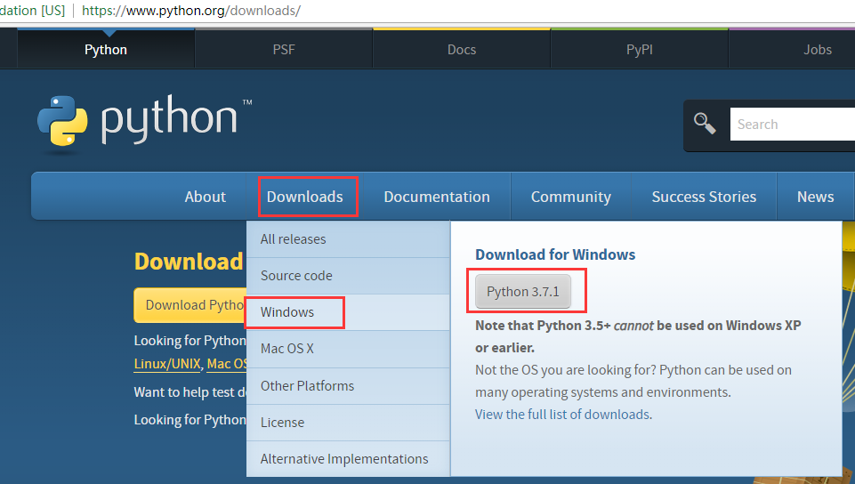
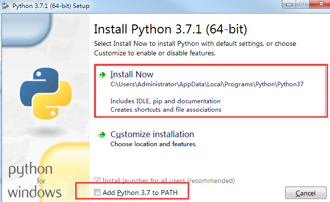
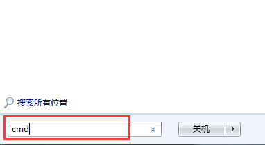
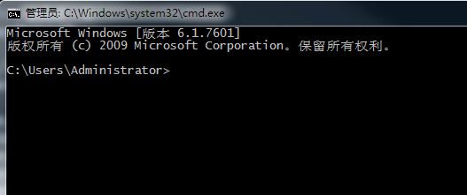
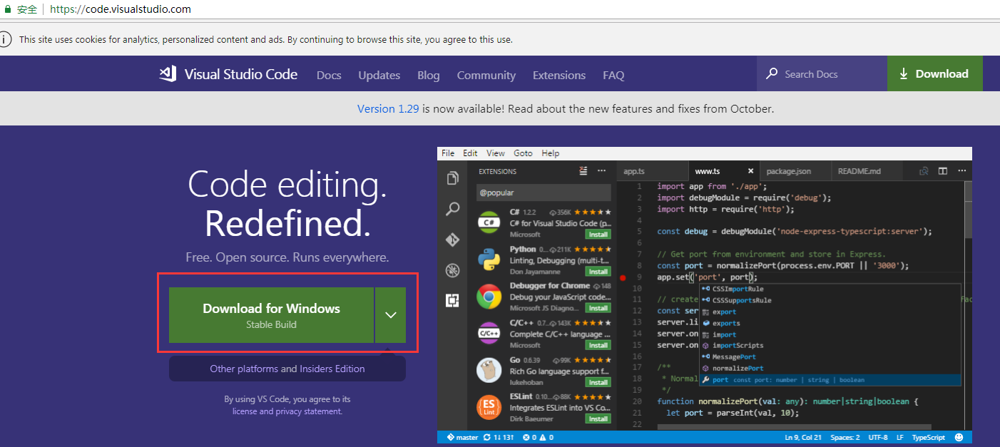
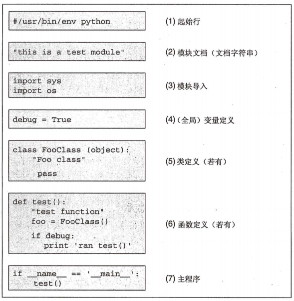

# Python 编程环境准备


## Python编程语言简介

上次我们提到计算机世界里有成百上千种语言 , 每种语言都在特定的领域流行 , 但是从使用人数上讲 , Python 语言目前排名TOP10 (2018年11月) .

Python 的爸爸是吉多·范罗苏姆 。1989年的圣诞节期间，吉多·范罗苏姆为了在阿姆斯特丹打发时间，决心开发一个新的`脚本解释程序`玩儿玩儿 , 在他这个解释器上可执行语言就叫Python 。 

Python（英国发音：/ˈpaɪθən/ 美国发音：/ˈpaɪθɑːn/），作为一种解释型语言，Python的设计哲学强调代码的可读性和简洁的语法。相比于C++或Java，Python让开发者能够用更少的代码表达想法。不管是小型还是大型程序，该语言都试图让程序的结构清晰明了。


## 编程环境安装

Python 是一种`解释型语言` , 由`解释器程序` 来运行,  这类能确保语言运行而需要额外安装/配置的软件 , 也叫语言的`运行环境`, 此外为了高效方便编写代码 , 还需要一些`代码文本编辑器`类程序来辅助 ,  这类辅助编写程序的程序和程序的运行环境一起 , 叫做`编程环境` . 接下来介绍下Python 编程环境的准备 。


### 编程工具选择

#### Python版本
由于Python发展了几十年, 所以环境也一直再演进 , 目前主要有2.X 和 3.X 两种环境, 由于2.X 和 3.X 在语言规范小细节上有一些不一样, 为了方便统一, 我们教程主要以3.X 版本来说明 , 所以我们选择目前最新的`Python 3.7.1` 来说明 .


#### 代码编辑器

代码其实只是一些文本, 所以用任何一个文本编辑器都可以编写代码, 不过有些编辑工具可以专门帮你提示代码, 检查代码的语法, 这样可以提升编写效率 , 在Windows下常用的有 `Notepad++`, `Visual Studio  Code` ,`Edit Plus` 等 .

我们选择`Visual Studio  Code` 简称`VS Code`.


#### Python 编程全家桶

##### 集成开发环境(IDE)
有一些强大的工具,集成了基础运行环境，还集成了代码编辑功能，还有程序架构，程序代码库管理，多人协作等很多功能，这种工具就叫`集成式开发环境` ( `IDE`) . 如微软的 `Visual Studio` , `PyCharm` 这类工具一般比较巨大臃肿, 适合大型项目多人协作开发 , 我们不需要这些 。


##### Python发行包运行环境
Python 运行环境很简单, 但是我们实际开发一些程序时，可能会引用到很多其他人编写的强大库，如数据处理和科学计算的 numpy , pandas 等, 基础环境中是不包含的, 引用时得自行安装下载 。所以有些组织只做了强大的发行版环境，直接集成了最常用的各种领域工具程序库 。比较著名的有Anaconda 。一般如果做领域应用开发和新环境部署可以使用 。


### Windows 下安装Python3.7和 VS Code


#### 下载安装包并安装

在浏览器中进入: https://www.python.org/downloads/ , 选择download 选择Windows 此时右边会有3.7.1 的现在按钮 .



[Python3.7.1 也可以直接在直接下载](https://www.python.org/ftp/python/3.7.1/python-3.7.1-amd64.exe)

下载后运行 , 注意勾选下方的ADD TO PATH. (如果没勾选PATH的话,得自己配置PATH环境变量)



> 安装Python 3.7.1 时,如果没有勾选"ADD TO PATH", 那么后面的命令python hello.py 不会成功, 会提示python程序找不到，那么你可以自己修改系统环境变量,将Python 3.7.1 的安装目录添加到 PATH中, 具体操作可以尝试搜索"PYTHON WINDOWS 添加PATH环境变量".


#### 安装完成后测试

点击Windows `开始`安妞  , 弹出搜索框, 输入`cmd`然后按`回车键`, 会打开一个`命令提示行窗口` 。






在窗口中输入`python -V` 应该看到显示 Python 3.7.1 的字样, 这样就表示您的Python运行环境已经安装完成 。


#### 安装VS Code
打开VS Code 官网:https://code.visualstudio.com , 点击下载, 然后一直点击下一步安装完成 .




### 其他系统中(Linux/Mac OSX ...)

一般来讲，默认系统已经安装了Python 环境, 只需要你使用比较熟悉的的代码编辑器编写代码, 在`终端`中运行即可, 比Windows 更简单 。
这里不做详细介绍, 可以自行Google / 百度 (Linux PYTHON 环境安装配置).


## Python 程序结构和运行

之前提到过程序就是你对要完成事情的描述 , 一个程序代码文件, 就像你给CE编写动作剧本一样 , 有格式要求 。

### 文件名
一般来讲 , Python 程序的代码文件文件名是以 .py 结尾的, 如 hello.py

### 文件内容(代码)
文件内容结构中主要包括:
1. 启开始声明 *[可选]*
2. 程序说明 *[可选]*
3. 模块导入 *[可选]*
4. 全局变量定义 *[可选]*
5. 类或者函数定义 *[可选]*
6. 程序指令 **[必选]**



### hello.py 代码示例
现在我们尝试编写第一个Python程序,他的功能是在屏幕上输出一段文字.

打开`VS Code`软件, 点击`File`->`New File` 创建一个文件, 输入以下代码, 然后将文件保存到`C:\py7h\hello.py `。

```python
print("Hello,World!") #print是Python解释器已经提供的基础功能,支持输出文字到屏幕.
```

这个代码文件只有一行, 其实就是只有 [必选] 的程序指令,没有其他的东西.
`print(x)` 就是系统内置的功能 , 可以实现把一段文字输出到屏幕上(很久以前的计算机,是纸带显示的,所以叫打印print) 。 这种完成一定功能的指令, 学名叫做`函数` (`function`), 在定义函数print(x)中, 其中`print`是这个函数的名字, 其中x叫做`函数的形式参数变量`,
简称`形参` 。当在实际使用时, 会把x替换成具体使用的实际值, 这里实例代码中, 我们使用时, 因为想输出值是`"Hello,World"`, 这个实际值"Hello,World!"叫做`函数的实际参数值`,简称`实参` 。

就像我们以前中学数序学过的函数sin(x) , sin就是函数名, x是sin函数定义时使用的形式参数变量 , 实际我们使用时 , 当要计算π/2弧度对应的sin函数值时, 会使用sin(π/2) 。那么 π/2 就是实际参数值.

### 执行hello.py
在`C:\py7h` 文件夹(你代码文件保存的目录)下 ,  `按住Shift键` 鼠标在`空白处点击右键`，弹出菜单中选择`在此处打开命令窗口`, 然后在弹出的`命令行窗口`(黑框)中输入:
> python hello.py
然后按回车键观察！

> 还有一种打开命令行窗口的方法是, 就像之前验证Python环境安装成功一样, 点击Windows`开始`,输入cmd回车打开命令行窗口,不过这时默认的目录不在你的代码目录,那么就需要输入`cd C:\py7h` 命令切换到C:\py7h .


如果你在黑框中看到`Hello,World!` 字样, 那么恭喜您 ！！！执行了第一行Python 程序 ! 成功开启了编程世界的大门 !


这段 hello.py 代码是在太简单了，可能你觉得原来编程怎么简单，但是好像没啥用哎 ? 嗯, hello.py 主要是个欢迎仪式 , 那么我们可以看看一个稍微复杂一点的代码的长相 。


### ce.py 代码示例

同hello.py类似, 将以下代码输入到VS Code中并保存为ce.py . 然后运行观察结果 .

```python
#coding:utf-8

"""
代码结构实例
"""

import sys #导入一个'系统'模块,以使用'系统'提供的功能

hi_words = 'Hi!' #代码中想引用的一段文字定义变量

class CE(object): #一种类的定义,未来我们会介绍.
    def __init__(self, name): #对象初始化的函数
        self.name = name

    def say_hello(self):#定义对象的提供某功能的函数
        words = '%s ! My name is %s .' % (hi_words, self.name) #拼接一段文字
        print(words) #显示文字

def hi_ce():    #定义了一个功能(函数) , 可以被调用.
    pe = CE('peter') #构造一个CE对象,对象名为pe
    pe.say_hello() #调用pe的的say_hello 函数

if __name__ == '__main__': #运行python文件时, __name__ 内置的变量会被Python解释器设置为__main__ ,如果被import 那么就不是.
    hi_ce() #调用hi_ce 我们定义的函数

```

显然, ce.py 比hello.py　看起来复杂了的很多，还有各种空格缩进, 后续我们会详细解释, 如果你现在觉得很自然,可以观察注释.

Python 代码中, 以#开始的部分叫做注释, 注释就像程序的批注, 只是给阅读的人看(帮助理解), 不影响机器的执行.
代码中还出现了以下概念:
* 类(class)
* 对象 (object)
* import
* 文字拼接
* 对象的初始化
* 对象的函数
* 构造对象

这些概念,我们在后面的课程会做解释 。


## Python 编程应用

Python 是一门通用编程语言, 意思是理论上Python可以干任何事情, 不过Python 最强大地方其实是社区很强大, 有非常丰富的第三方库 .
目前在互联网Web内容开发, 服务器应用, 系统管理, 运维自动化, 数据科学(数据分析,数据挖掘，数据可视化等), 机器学习领域尤其使用的多 。


## 总结

本文首先简单介绍了Python 语言，然后介绍了Python编程环境的搭建,然后以两个小代码座位示例展示了Python的代码外观,最后简单介绍了下Python目前在相关领域的应用情况 。下一课我们将具体学习一个Python 的语法和计算表达式。
本课主要有以下概念:
* 运行环境
* 编程环境
* Python 版本
* 函数
* 函数的形式参数和实际参数
* 代码注释


## 思考小测验
1. 运行ce.py 观察结果，尝试修改下ce.py中的缩进再运行.
3. 尝试从Windows开始按钮中启动命令行运行hello.py的方式.
3. 尝试查找VS Code 的插件, 以支持在VS Code中直接运行Python代码.
