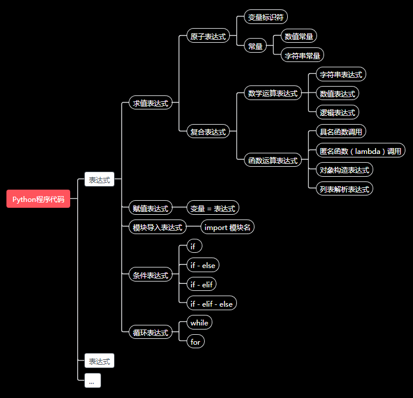

# 语法与计算表达式

上节课已经将`Python 编程环境`准备完成, 还介绍了一个Python代码的主要结构, 这节课具体展开Python代码的语法和其中的表达式部分 .


## 基础语法

如下是python的基础语法分解 , 从上到下逐步分解 。

```
程序代码
    表达式[;表达式]
    表达式[<换行>表达式]

表达式
    求值表达式
    赋值表达式
    模块导入表达式
    条件表达式
    循环表达式

求值表达式
    原子表达式
        标识符: words_to_say (变量)
        数值: 3.14159265358 (常量)
        字符串: "How do you do ?" (常量)
    符号运算表达式: 3.1415 * 2.5 * 2.5 * num_of_circle + 3 * 4 * num_of_rect
    函数调用表达式

数学运算表达式
    字符串表达式
    数值表达式
    逻辑表达式

复合表达式
    数学运算表达式
    函数运算表达式

赋值表达式
    标识符 = 表达式

函数运算表达式
    函数名(函数参数): print(3.1415926)
    匿名函数表达式(lambda): (lambda x: 3.14159265*x*x )(2.5)
    对象构造表达式: CObj(...)
    列表解析表达式: [v(x) for x in itr if b(x)]

模块导入表达式
    import <模块名>： import sys

条件表达式    
    if <逻辑表达式> :
    [空白缩进]程序代码

    if <逻辑表达式>:
    [空白缩进]程序代码
    else:
    [空白缩进]程序代码


循环表达式
    while <逻辑表达式>:
    [空白缩进]程序代码
    
    for itr in <可迭代值的表达式>:
    [空白缩进]程序代码

```

这里解释下上面的语法归纳(暂时简单归纳,其实并不完全,但是对我们的课程使用足够了) ,  用下图来配合说明 。




### 顺序代码执行


### 缩进法则

Python 的代码块中，主要有条件表达式和循环表达式, 其中涉及到嵌入`程序代码` , 程序代码呢, 又是一个完整的程序结构, 所以需要一种形式标识出来, 其他语言使用`{ ... }` 这种形式来标记, Python中使用的是缩进对齐方式来标记, 这样可以保证代码的优雅美观 .

缩进空白字符没有规定要缩进多少个, 规则是代码块的`缩进应当对齐`, 缩进`空白字符至少1个`, 通常每级代码块我们使用`4个空格字符`缩进 .

如下代码都是合法的:
```python
if cond_var:
 print("hello1 code block with 1 white characters")
 print("hello2 code block with 1 white characters")

 if cond_var:
   print("hello1 code block with 2 white characters")
   print("hello2 code block with 2 white characters")

 if cond_var:
     print("hello1 code block with 4 white characters")
     print("hello2 code block with 4 white characters")


```

这里演示一个语法错误的代码段:

```python
if cond_var:
 print("hello code block with 1 white characters")
   print("hello code block with 2 white characters (错误代码,应当与代码块上一行对齐,1个空格)")
     print("hello code block with 4 white characters (错误代码,应当与代码块第一行对齐,1个空格)")

```


### 代码规范

Python本身语法比较简单,并没有规定太多. 但是写代码就像写文章, 如果遵循一定大家默认守则, 可以让别人阅读的更容易, 自己写完后再阅读也能快速回忆起当时编写的思路。
其中[PEP8,Python社区的语言规范建议/提案] 规范建议了Python代码中的元素,如变量,函数,对齐,命名的规范, 这样比较有Python的范儿 . https://pypi.org/project/pep8/
Google 公司(Python语言的爸爸也在Google工作)也推出了自己的Python代码规范建议:https://google.github.io/styleguide/pyguide.html


## 计算表达式

从语言基础语法分解树我们也可以看到, Python 代码的主要构成是各类表达式,几乎一切都是表达式 。

我们先熟悉下其中的`计算表达式` 。


### 表达式语法

#### 原子常量表达式

#### 复合表达式

##### Python数据类型

##### 数学运算表达式

##### 函数调用表达式

### 表达式求值

#### 运算优先级


## 总结
本课程主要介绍了下Python的语法概览, 我们学习一门语言一个主要任务是学习语言的语法, 有了语法后就可以按照语法来表达程序的思想, 本课还着重介绍了其中的基础运算表达式, 数据类型, 和表达式求值概念, 还提及了后续会详细介绍的字符串,函数,变量概念. 后续的5节课其实都是在介绍本课程提到Python的语法树概念, 下一课我们介绍变量和控制结构概念 。

本课主要需要掌握以下概念:
* Python代码语法树
* 顺序代码执行
* 缩进法则
* 常量表达式
* 算数运算表达式
* 数据类型概念
* 运算符优先级
* 函数调用表达式


## 小测验
1. 编写代码求3.25m半径的圆的面积 (圆面积公式是 pi*r*r)
2. 这个表达式 `"Hi,Kity" + 3.25` 是否合法 ? 想想为什么呢 ?
3. 数学表达式 `2.24*521+22412*2.4/(98.4+256.821*6.11)` 的运算先后顺序是怎样的 ?
4. 怎样用Python表达 `猫喜欢吃胡萝卜并且兔子爱吃鱼或者冬天不冷` ?


