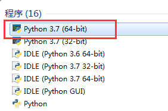
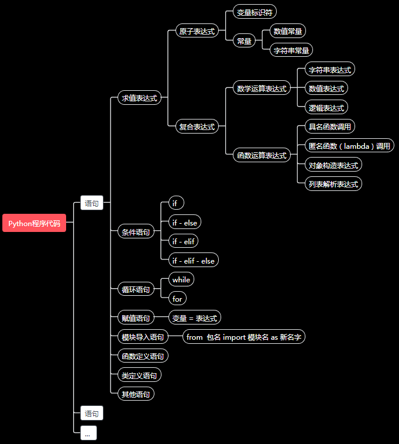

# 语法与计算表达式

上节课已经将`Python 编程环境`准备完成, 还介绍了一个Python代码的主要结构, 这节课具体展开Python代码的语法和其中的表达式部分 .

## 交互式执行 Python 解释器
由于这节课会有大量短小代码举例, 暂时不用编写长篇代码, Python的解释器程序提供了一个可以一边输入代码,一边执行的环境, 这种一边输入代码,一边执行的过程,
也叫做`交互式执行` , 特别适合验证短小代码语法正确性 。

在安装了Python 3.7.1 后, 您可以在命令行窗口中输入Python 然后就可以启动Python 解释器 。 

也可以点击Windows开始菜单 , 在开始菜单中 , 输入Python 搜索, 然后选择Python 3.7.1 程序直接打开 。




在Python解释器中, 就可以直接输入`表达式` , 如果是一个完整的`表达式` 回车后就会输出表达式的结果`值` 。

## 基础语法

Python 代码语法其实很简单, 就像说话表达一样 , 一段话总是由句子构成 。 从最上层看, Python代码都是语句构成的 。
```
程序代码
    语句[;语句]
    语句[<换行>语句]
```
Python的`程序代码` 由`语句`序列构成 。
如果有多个语句, 那么语句之间可以通过`;`或者`换行`分割 。
例如:
```python
1+2;(3+5)*7 #两个计算表达式,通过`;` 连接
2/4
1+5+7+7*2+1
```
以上代码就有4个语句, 第一行两个算数表达式是两个语句, 通过`;`组成 , 第一行,第二行和第三行的语句通过`换行`分割 。

当程序运行时 , 解释器按照输入顺序, `从左往右,从上往下`, 顺序执行每条语句 , 这种默认顺序代码执行顺序叫做`顺序执行结构`。 

在你的解释器程序中 , 你可以尝试输入以上代码然后按回车键观察 , 会发现以上每个算数表达式结束后, 解释器都会输出`结果值`, 这是因为如果一条语句是一个`表达式`, 那么每个表达式都有一个结果`值`, 解释器会做求值计算, 为了方便人类观察， 会把求值结果输出到屏幕 。

那么在Python中, 具体有哪些语句呢 ?

### 语句
```
语句
    求值表达式
        原子表达式
            标识符: words_to_say (变量)
            数值: 3.14159265358 (常量)
            字符串: "How do you do ?" (常量)
        复合表达式
            数学运算表达式
                字符串计算表达式
                数值计算表达式
                逻辑计算表达式
            函数运算表达式
                函数调用: print(3.1415926)
                匿名函数表达式(lambda): (lambda x: 3.14159265*x*x )(2.5)
                对象构造表达式: CObj(...)
                列表解析表达式: [v(x) for x in itr if b(x)]
    -------------------------------------------------------------------
    条件语句
    循环语句    
    赋值语句 
    模块导入语句
    函数定义语句
    类定义语句  
    其他语句

```
这里大致列举了常见的按照功能分类的语句, 可以分为8类:
* `求值表达式`
* `条件语句`
* `循环语句`
* `赋值表语句`
* `模块导入语句`
* `函数定义语句`
* `类定义语句`
* `其他语句`

#### 求值表达式
求值表达式是指, 这个表达式的主要目标是求值 , 通常用来计算或者调用函数执行指定功能 。

求值表达式 , 可以分为:
* `原子表达式`
* `复合表达式` 。

`原子表达式`是指这个表达式是一个不可分割的基本值 , 主要有三种:

* `标识符变量` 
* `数值常量`
* `字符串常量`

而`复合表达式` 是指由各种`表达式`通过`运算符`构成的表达式 。 这个表达式的定义使用了表达式自身的概念, 这种定义叫做`递归定义`的概念, 有点像数学归纳法哈 。
就是说表达式可以是一常量或者变量这样的表达式基本单元构成, 还可以是表达式之间通过运算符(如加减乘除求幂求对数等运算) 连接构成 。

##### 原子表达式 

`常量` 是指在代码中已经明确了(字面)值, 又不需要运算的代码表达 。 比如 `5` , `3.0245`, `"R U OK?"` , 通俗来讲, 这些代码中`写死`的值就叫做(字面)常量 。

> 还记得被遗忘的CE么 ? 你给CE 100元, 跟CE说:"去买`2.5`Kg大米, 再买`1` 个西瓜, `剩余的钱`买糖, 跟老板复述说:`只要麒麟瓜,6斤以上`..." ， 这里的2.5, 1, "只要麒麟瓜,6斤以上" 是你在指令中直接表明的量就是常量, 对于数字来说, 叫做`数值常量`, 对于文字来说, 叫做`字符串常量` .

如下代码:
```python
print("Hi")
```
这个代码中, `"Hi"` 就是常量 。


`变量` 是指在代码中以`标识符名字`代替具体的值, 而值可以随着代码被改变, 只有再运算时由计算机求值才能计算得知的那些表达量 。比如下代码:

```python
words = "Hi!"
print(words)

x=2.0
y=x*x
x=3.0
y=x*x*x
print(y)
```

代码中的`words` 就是一个变量 , words在作为实参传给print函数时,print要输出具体的内容(当然不是显示成"words"), 所以需要先对words求值, 只有求值后print才能输出words真正内容"Hi!"。
代码中的`x`,`y`也是变量, `x`,`y` 都只是个具体值的`名字` , 而且他们的值在运行过程中会发生改变 。

> CE 买了大米, 西瓜, 直到他买完付款, 才知道`剩余的钱` 是 43 元, 那么这时候才知道`剩余的钱`其实是指代`100元减去购买大米和西瓜后找回的钱` , 这就是个变量 , 如果当天的西瓜和大米价格有变化, 这个`剩余的钱`也会随着变化 , 话说回来, 其实`西瓜和大米的价格`也是个变量, 会随着市场行情变化  。

关于变量更具体的解释 , 我们在第四课再展开。

##### 复合表达式

复合表达式是将表达式组合出复杂表达式的手段 , 就像数学中, 我们本来只有实数(常量), 然后引入了代数字母 (a,b,c:变量) , 将实数和实数, 实数和代数字母通过各种加减乘除等运算组合在一起构成了代数表达式,
比如 1.52 * a + 2.56 * b 。 按照运算形式不同, 我们可以将复合表达式分为:
* `数学符号运算表达式`
* `函数运算表达式`

数学运算符号表达式是指那些用 `运算符` 连接起来的表达式， 例如: `5+4` ， `5 * x * x` , `the_cat_is_smelly or (5 -3) > 0 and (2.0 * x * x) < 2.452` 。

求值运算符表达式, 一会儿我们会详细介绍 。

函数运算表达式是指, 使用`函数类`参与运算的表达式例如: `math.sin(2.6423)` , `math.sqrt(5.21)`, `print("HelloKity")` 。

函数和类等的内容我们在第五课会详细解释 。

#### 其他非表达式语句

以下语句自身有特定的结构(语法) , 这里只做简单解释介绍, 后续会详细讲解 。

```
赋值语句
    标识符 = 表达式

模块导入语句
    import <模块名>： import sys

条件语句    
    if <逻辑表达式> :
    [缩进]程序代码

    if <逻辑表达式>:
    [缩进]程序代码
    else:
    [缩进]程序代码


循环语句
    while <逻辑表达式>:
    [缩进]程序代码
    
    for itr in <可迭代值的表达式>:
    [缩进]程序代码

类定义语句
    class ClassName(object):
    [缩进]<Class Body>
函数定义语句
    def Function Name(Arguments List):
    [缩进]<Function Body>

```
#### 赋值语句

`变量` 是执行代码指令时 , 给那些表达式的结果值一个名字, 后面的表达式在使用时就方便了很多 。 `变量名` = `表达式` ， 这就是一条赋值语句 。
执行后 , 这个变量就保存了`表达式的值` (或者引用,后续再详细讨论)。

#### 模块导入语句

模块导入语句是指 , 当我们的代码引用到其他的代码文件时, 需要导入`第三方代码`时的语法 , 在第八课我们再讲 。

#### 条件语句

条件语句是指 , 代码默认只能顺序执行，但是我的代码需要处理动态情况 , 比如 `变量` x 取值在某个区间`[1,2)`时,我输出"NiHao", 否则我输出"Hello", 就是代码执行要根据条件选择选择执行 。
那么就得用条件语句来表达 ，在下节课我们详细展开 。

#### 循环语句

循环语句是指 , 代码默认只能顺序执行，但是我的代码需要处理动态情况 , 比如我要将 "NiHao" 这段文字输出n次, 而n是一个`变量`(根据情况,可能是1,也可能是1亿), 就是代码可以支持某种环境循环执行 。
那么就得用循环语句来表达 ，在下节课我们详细展开 。

#### 函数定义语句,类定义语句

函数定义是指将完成一定功能的代码封装成一个接口(名字),  然后就可以被其他代码直接用名字使用 。 例如我定义一个计算球体体积的函数 , 那你计算球体体积时, 只需要把半径参数传给我, 我就给你计算好了 。
类定义也是类似函数, 就算没有类, 也不影响你的代码描述 , 不过有类之后 , 在语言表达方式上, 比较适合人类的一些思维习惯 。
函数和类在第五课我们详细解释 。

#### 其他语句
还有其他如 with 语句, 一些语法糖(以上语法的变种写法,只是为了方便)等,我们在后续遇到了再解释把 , 这些在入门阶段不重要 。


### 语法归纳

根据以上的介绍, 可以用以下图概括Python 的主要语法树结构 。




### 缩进法则

Python 的代码块中，主要有条件语句和循环语句,以及类,函数定义体涉及到嵌入`程序代码` , 程序代码呢, 又是一个完整的程序结构块, 所以需要一种形式标识出来, 其他某些语言使用`{ ... }` 这种形式来标记, 而Python中使用的是缩进对齐方式来标记, 这样可以保证代码的优雅美观 .

缩进空白字符没有规定要缩进多少个, 规则是代码块的`缩进应当对齐`, 缩进`空白字符至少1个`, 通常每级代码块我们使用`4个空格字符`缩进 .

如下代码都是合法的:
```python
if cond_var:
 print("hello1 code block with 1 white characters")
 print("hello2 code block with 1 white characters")

 if cond_var:
   print("hello1 code block with 2 white characters")
   print("hello2 code block with 2 white characters")

 if cond_var:
     print("hello1 code block with 4 white characters")
     print("hello2 code block with 4 white characters")


```

这里演示一个语法错误的代码段:

```python
if cond_var:
 print("hello code block with 1 white characters")
   print("hello code block with 2 white characters (错误代码,应当与代码块上一行对齐,1个空格)")
     print("hello code block with 4 white characters (错误代码,应当与代码块第一行对齐,1个空格)")

```

### 代码规范

Python本身语法比较简单,并没有规定太多. 但是写代码就像写文章, 如果遵循一定大家默认守则, 可以让别人阅读的更容易, 自己写完后再阅读也能快速回忆起当时编写的思路。

其中[PEP8,Python社区的语言规范建议/提案] 规范建议了Python代码中的元素,如变量,函数,对齐,命名的规范, 这样比较有Python的范儿. https://pypi.org/project/pep8/

Google 公司(Python语言的爸爸就在Google工作)也推出了自己的Python代码规范建议:https://google.github.io/styleguide/pyguide.html


## 求值表达式

由于表达式求值在代码计算中非常重要，是语言表达的基础, 这里会详细解释下 。

### 再论表达式的递归定义

上文有提到表达式的`递归定义`:

> 表达式要么是常量或者变量(原子表达式) , 要么是 对表达式运算 构成 .

按照语法形式分为:
* `数学符号运算表达式`
* `函数运算表达式`

#### 数学符号运算表达式
Python 支持的运算符就像数学上常见到的基础四则运算 。

##### 数值算数运算符:
* + 加法 , 5+3 ，结果为8
* - 负号 或者 减法 , 如: -5 (对5取负为-5)， 5-3 ，结果为2
* * 乘法 , 5*3 , 结果为15
* / 除法 ， 5/3 , 结果为 1.6666666666666667
* **  乘方(求幂,指数运算),  3**2 , 结果为 9
* % 取模运算 (求除法余数) , 5%3 , 结果为: 2
* // 整数除法(向下取整) , 如: 5//3 结果为: 1


逻辑运算表达式是指使用以下逻辑运算符连接表达式, 运算结果为 `True` (真值) 或者  `False` (假值) 的表达式 。 也对应于数学中的`布尔逻辑表达式` 。
在程序中, 通常用来表达一些(变量)值 是否 符合某些数值关系 , 如 `番茄价格` 比 `大米价格` 贵 , 对应到单价数值上就是判断两个数值大小 。

##### 关系运算符:
* == ,  a == b , 判断两个表达式值相等, 判断 5 == 3 结果为 False
* != , a != b , 两个表达式值不相等, 判断 5 != 3 结果为 True
* < , 小于， a < b , 小于关系, > 5 < 3 ，结果为 False
* > , 大于, 5 > 3 , 结果为 True
* <= , 小于或等于, 5 <= 3 , 结果为 Fals
* >= , 大于或等于 , 5 >= 3, 结果为 True
* is , a is b ， 表示 a 和 b 是同一个对象 。
* is not , a is not b , 表示 a 和 b 不是同一个对象 。
* in , a in B, 表示 a 在集合 B 中 。
* not in , a not in B 表示a 不在集合 B中 。

用于描述对多个逻辑表达式连接的情况使用逻辑运算符连接 , 如 `番茄价格` 价格 和  `大米价格` 都比 `西瓜价格` 便宜 , 翻译过来就是说 番茄比西瓜便宜 `并且` 大米也比习惯便宜 。
##### 逻辑运算符
* and , 并且的关系 , a and b , 当这个表达式为真 , 当且仅当 a 值为True, 并且 b 值也是True 。
* or , 或者的关系 , a or b ,  这个表达式为真, 当且仅当 a 值为True, 或者 b 值 为 True 。
* not , 取反(非)关系, not a, 表示和a的值相反， 如果a是True，那么 not a就是False， 如果a是False, 那么not a 就是True .


其他还有:
##### 赋值运算符
在赋值语句中使用, 为了方便又将赋值语句算数运算写在一起 。其他类似 += ， *= ， /= 的运算, 可以认为是`语法糖` , 

如 a += b , 计算等价于 a = a + b , a-= b , 等价于a = a - b , 一次类推这里就不再解释了。


##### 位运算符

计算机中数值是使用二进制比特位(类似1010010101010101) 编码表示 ，某些情况下为了使用这个二进制表示的特性, 需要操作对应的比特位 , 所以针对整数也提供了位运算操作 。

这里简单解释下位运算 , 不做详细解释 , 在入门课程中基本不涉及到位运算 , 如有需要了解可通过 Google 搜索 "位运算原理" 查阅相关资料 。
* &	,按位与运算符：参与运算的两个值,如果两个相应位都为1,则该位的结果为1,否则为0	(a & b) 输出结果 12 ，二进制解释： 0000 1100
* |	,按位或运算符：只要对应的二个二进位有一个为1时，结果位就为1。	(a | b) 输出结果 61 ，二进制解释： 0011 1101
* ^	,按位异或运算符：当两对应的二进位相异时，结果为1	(a ^ b) 输出结果 49 ，二进制解释： 0011 0001
* ~	,按位取反运算符：对数据的每个二进制位取反,即把1变为0,把0变为1 。~x 类似于 -x-1	(~a ) 输出结果 -61 ，二进制解释： 1100 0011，在一个有符号二进制数的补码形式。
* << ,左移动运算符：运算数的各二进位全部左移若干位，由 << 右边的数字指定了移动的位数，高位丢弃，低位补0。	a << 2 输出结果 240 ，二进制解释： 1111 0000
* >> ,右移动运算符：把">>"左边的运算数的各二进位全部右移若干位，>> 右边的数字指定了移动的位数


#### 函数运算表达式

数学上, 将某些代数运算表达式作为`公式` 列举，就是说这个`公式` 只要替换掉其中的变量, 在别的地方可以引用计算 。 Python 中系统提供了大量的函数可以负责计算的，也可以完成指定功能的。
例如 math.sqrt(5.32) 就可以求出 5.32 的皮平方根 , 如果需要求直角三角形斜边长度的函数，已经有两个直角边的长度 , 假设两个长度变量名字为 a, b , 那么假设斜边长度变量为 hypo_length , 则 hypo_length = `math.sqrt(a**2　+ b**2)` 右边的表达式有函数调用 math.sqrt 也有算数表达式 , 这个表达式里有函数运算也有各种算数预算，这些运算一起也做为表达式, 可以再被函数 , 或者其他运算连接起来 。

### 数据类型

在数学上，我们知道算数运算+-*/只能针对的是实数运算,  在代码中还有文字, 那么一段文字"R U OK?"和 5做加法是比较奇怪的吧, 语义上是说不通的 , 所以每个运算符 对运算对象, 函数对 实参也有是要求的 。这样的话，要求就是对所有的运算对象(求值), 分类,  同类可以支持一些运算, 异类可以支持另一些运算操作 。 

在Python中有以下6大类数据(值)类型:
* `Number`（数字）
* `String`（字符串 , 描述一段文字 ）
* `List`（列表 , 描述有一系列顺序的元素）
* `Tuple`（元组, 描述有一系列顺序的元素, 不过不可以修改）
* `Set`（集合, 和数学上的集合同样, 唯一性, 无序性,确定性）
* `Dictionary`（字典, 每个元素有一个关键字, 使用关键字可以快速查找到对应的元素,就像查字典）


这里说明下`Number`类型, 其他类型在后续文章中会详细介绍 。

`Number` 表示的是数值类型, 可以分为以下几个子类型:
* `complex` (复数) , 比如 3.71+5.22j (实部为3.71, 虚部为5.22)
* `float` (浮点数, 就是可以带小数的) , 比如 23.55, 1.0, -24.110009
* `int` (整数, integer) , 不含小数点的数字 , 比如 -4， 1， 42， 931123475002
* `bool` (布尔型, 取值为True 或者 False)

之前介绍的所有算数运算的对象都是 `Number` , `Number` 之间运算如果类型不一样时, 会向上(就是刚才列举的上下关系) 自动做`隐式类型转换`, 比如:
* `True + 1 `计算得到值是2 , 会把True 转换为integer 类型的1， False 转换为integer 类型的0 。
* `False + 2.5` 计算结果是 2.5 。
* `2 - 2.356`
* `2+(4.2+5j)` 结果是 6.2 + 5j 。

`Number` 的值向上可以自动转换, 他们之间也可以做`显式类型转换` , 就是在代码中用类型指示一个量是什么类型, 不过这样可能会发生精度损失。 如：
* `int(2.5566)` 吧 2.5666 float类型转换为 int 类型 , 值就是2 。
* `bool(1)` === `True` , `bool(5)` === `True` , 其中bool类型转换规则是, 数值不等于0 那么就是 True , 否则就是False .

**不过需要说明, 对于`complex` 复数, 向下转换类型是不允许的, 因为复数和整数的转换在数学上不好定义 (建议您尝试写一个将复数转换为整数的表达式 再解释器中观察下)。**

#### 运算符优先级

复合表达式中, 有很多运算符，我们可能知道对于+-*/ 是*/优先于+-,但是在Python中海扩充了其他运算符, 出现其他运算符时, 那些部分应该先计算, 那些部分应该后计算呢, 这取决于运算符的优先级, 以下列表就是运算符优先级从高到低的排列, 对于相同优先级, 则从左到右即可。有括号`()` 时,当然要优先计算括号中的表达式啦 。

* ** 指数 (最高优先级)
* ~ + -	按位翻转, `一元加号`和`一元减号` (最后两个的方法名为 +@ 和 -@ , 注意不是加法和减法哈)
* * / % //	乘，除，取模和取整除
* + -	加法减法
* >> <<	右移，左移运算符
* &	位 'AND'
* ^ | 位运算符
* <= < > >=	比较运算符
* <> == !=	等于运算符
* = %= /= //= -= += *= **=	赋值运算符
* is is not	身份运算符
* in not in	成员运算符
* and or not	逻辑运算符

举个例子:
`5-3*7+6**2-84/7 >= 2.9 and 4 % 2 / (3 + 2.8) != 0` 这么长一个表达式 , 我们根据以上表格运算符优先级一步一步看:
最高优先级是()中的部分和**运算, 所以计算那个部分后:
`5-3*7+36-84/7 >= 2.0 and 4 % 2 / 5.8 != 0`
然后乘法除法取模(求余) , 相同优先级从左往右:
`5-21+36-12.0 >= 2.0 and 0 / 5.8 != 0` => `5-21+36-12.0 >= 2.0 and 0 != 0`
然后再算加法减法:
`8.0 >= 2.0 and 0 != 0` 
然后才是逻辑运算
`True and False`

所以最后结果是`False`

千万不要被上面一大堆运算符的优先级吓到了, 通常人类写表达式还是比较收敛的 ,不会像上文那样搞一些骚操作, 有拿不准的地方用括号就好了, 按照数学上的四则运算即可 , 首先是指数优先, 然后是符号(正号负号) , 然后是四则运算, 最后才是逻辑连接词`and` `or` 这种 。

用你的数学直觉去理解算数表达式就好了, 一般不也不会错 , ^_^ 。


## 总结
本课程主要介绍了下Python的语法概览, 我们学习一门语言一个主要任务是学习语言的语法, 有了语法后就可以按照语法来表达程序的思想, 本课还着重介绍了其中的基础运算表达式, 数据类型, 和表达式求值概念, 还提及了后续会详细介绍的字符串,函数,变量概念. 后续的5节课其实都是在介绍本课程提到Python的语法树概念, 下一课我们介绍变量和控制结构概念 。

本课主要需要掌握以下概念:
* 交互式执行
* Python代码语法结构
* 语句
* 顺序代码执行
* 缩进法则
* 常量和变量
* 复合表达式
* 数据类型概念
* 运算符优先级


## 小测验
1. 编写代码求3.25m半径的圆的面积 (圆面积公式是 pi*r*r)
2. 在解释器中测试这个表达式`int((6+5j)+245)`和 `"Hi,Kity" + 3.25` 是否合法 ? 想想为什么呢 ?
3. 数学表达式 `2.24*521+22412*2.4/(98.4+256.821*6.11) - 2 > 1.0 or 2.5**2 + 3 - 4 <= 200.01` 的运算先后顺序是怎样的 ?
4. 怎样用Python的逻辑运算符表达 `猫喜欢吃胡萝卜并且兔子爱吃鱼或者冬天不冷` ?


