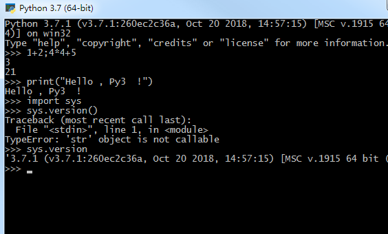

# 语法与计算表达式

上节课已经将`Python 编程环境`准备完成, 还介绍了一个Python代码的主要结构, 这节课具体展开Python代码的语法和其中的表达式部分 .

## 交互式执行 Python 解释器
由于这节课会有大量短小代码举例, 暂时不用编写长篇代码, Python的解释器程序提供了一个可以一边输入代码,一边执行的环境, 这种一边输入代码,一边执行的过程,
也叫做`交互式执行` , 特别适合验证短小代码语法正确性 。

在安装了Python 3.7.1 后, 您可以在命令行窗口中输入Python 然后就可以启动Python 解释器 。 

也可以点击Windows开始菜单 , 在开始菜单中 , 输入Python 搜索, 然后选择Python 3.7.1 程序直接打开 。




在Python解释器中, 就可以直接输入`表达式` , 如果是一个完整的`表达式` 回车后就会输出表达式的结果`值` 。

## 基础语法

Python 代码语法其实很简单, 就像说话表达一样 , 一段话总是由句子构成 。 从最上层看, Python代码都是语句构成的 。
```
程序代码
    语句[;语句]
    语句[<换行>语句]
```
Python的`程序代码` 由`语句`序列构成 。
如果有多个语句, 那么语句之间可以通过`;`或者`换行`分割 。
例如:
```python
1+2;(3+5)*7 #两个计算表达式,通过`;` 连接
2/4
1+5+7+7*2+1
```
以上代码就有4个语句, 第一行两个算数表达式是两个语句, 通过`;`组成 , 第一行,第二行和第三行的语句通过`换行`分割 。

当程序运行时 , 按照输入顺序, `从左往右,从上往下`, 顺序执行每条语句 , 这种默认顺序代码执行顺序叫做`顺序执行结构`。 在你的解释器程序中 , 你可以尝试输入以上代码然后按回车键观察 ,
会发现以上每个算数表达式结束后, 解释器都会输出`结果值`, 这是因为如果一条语句是一个`表达式`, 那么每个表达式都有一个结果`值`, 解释器会做求值计算, 为了方便人类观察， 他会把求值结果输出到屏幕 。

那么在Python中, 具体有哪些语句呢 ?

### 语句
```
语句
    求值表达式
        原子表达式
            标识符: words_to_say (变量)
            数值: 3.14159265358 (常量)
            字符串: "How do you do ?" (常量)
        复合表达式
            数学运算表达式
                字符串计算表达式
                数值计算表达式
                逻辑计算表达式
            函数运算表达式
                函数名(函数参数): print(3.1415926)
                匿名函数表达式(lambda): (lambda x: 3.14159265*x*x )(2.5)
                对象构造表达式: CObj(...)
                列表解析表达式: [v(x) for x in itr if b(x)]
    -------------------------------------------------------------------
    条件语句
    循环语句    
    赋值语句 
    模块导入语句
    函数定义语句
    类定义语句  
    其他语句

```
这里大致列举了常见的按照功能分类的语句, 可以分为5类:
* `求值表达式`
* `条件语句`
* `循环语句`
* `赋值表语句`
* `模块导入语句`
* `函数定义语句`
* `类定义语句`
* `其他语句`

#### 求值表达式
求值表达式是指, 这个表达式的主要目标可能是求值 , 通常用来。


#### 赋值语句


#### 模块导入语句

#### 条件语句

#### 循环语句

#### 函数定义语句

#### 类定义语句

#### 其他语句

还有其他如 with 语句等

```
赋值语句
    标识符 = 表达式

模块导入语句
    import <模块名>： import sys

条件语句    
    if <逻辑表达式> :
    [空白缩进]程序代码

    if <逻辑表达式>:
    [空白缩进]程序代码
    else:
    [空白缩进]程序代码


循环语句
    while <逻辑表达式>:
    [空白缩进]程序代码
    
    for itr in <可迭代值的表达式>:
    [空白缩进]程序代码

```

这里解释下上面的语法归纳(暂时简单归纳,其实并不完全,但是对我们的课程使用足够了) ,  用下图来配合说明 。


### 顺序代码执行


### 缩进法则

Python 的代码块中，主要有条件语句和循环语句涉及到嵌入`程序代码` , 程序代码呢, 又是一个完整的程序结构, 所以需要一种形式标识出来, 其他某些语言使用`{ ... }` 这种形式来标记, 而Python中使用的是缩进对齐方式来标记, 这样可以保证代码的优雅美观 .

缩进空白字符没有规定要缩进多少个, 规则是代码块的`缩进应当对齐`, 缩进`空白字符至少1个`, 通常每级代码块我们使用`4个空格字符`缩进 .

如下代码都是合法的:
```python
if cond_var:
 print("hello1 code block with 1 white characters")
 print("hello2 code block with 1 white characters")

 if cond_var:
   print("hello1 code block with 2 white characters")
   print("hello2 code block with 2 white characters")

 if cond_var:
     print("hello1 code block with 4 white characters")
     print("hello2 code block with 4 white characters")


```

这里演示一个语法错误的代码段:

```python
if cond_var:
 print("hello code block with 1 white characters")
   print("hello code block with 2 white characters (错误代码,应当与代码块上一行对齐,1个空格)")
     print("hello code block with 4 white characters (错误代码,应当与代码块第一行对齐,1个空格)")

```


### 代码规范

Python本身语法比较简单,并没有规定太多. 但是写代码就像写文章, 如果遵循一定大家默认守则, 可以让别人阅读的更容易, 自己写完后再阅读也能快速回忆起当时编写的思路。
其中[PEP8,Python社区的语言规范建议/提案] 规范建议了Python代码中的元素,如变量,函数,对齐,命名的规范, 这样比较有Python的范儿 . https://pypi.org/project/pep8/
Google 公司(Python语言的爸爸也在Google工作)也推出了自己的Python代码规范建议:https://google.github.io/styleguide/pyguide.html


## 总结
本课程主要介绍了下Python的语法概览, 我们学习一门语言一个主要任务是学习语言的语法, 有了语法后就可以按照语法来表达程序的思想, 本课还着重介绍了其中的基础运算表达式, 数据类型, 和表达式求值概念, 还提及了后续会详细介绍的字符串,函数,变量概念. 后续的5节课其实都是在介绍本课程提到Python的语法树概念, 下一课我们介绍变量和控制结构概念 。

本课主要需要掌握以下概念:
* 交互式执行
* Python代码语法结构
* 语句
* 顺序代码执行
* 缩进法则
* 常量表达式
* 算数运算表达式
* 数据类型概念
* 运算符优先级
* 函数调用表达式


## 小测验
1. 编写代码求3.25m半径的圆的面积 (圆面积公式是 pi*r*r)
2. 这个表达式 `"Hi,Kity" + 3.25` 是否合法 ? 想想为什么呢 ?
3. 数学表达式 `2.24*521+22412*2.4/(98.4+256.821*6.11)` 的运算先后顺序是怎样的 ?
4. 怎样用Python表达 `猫喜欢吃胡萝卜并且兔子爱吃鱼或者冬天不冷` ?


